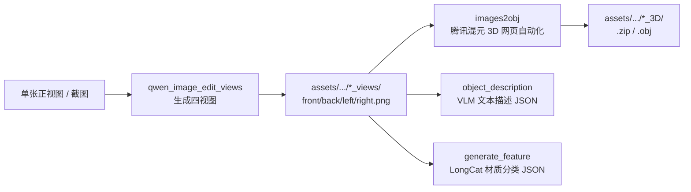

# VLA-Benchmark-Rush

面向 VLA（Vision-Language-Action）评测与仿真的**物体资产构建流水线**。本仓库将「单张参考图 → 四视图 → 3D 模型 → 语义/材质标注」串成可复现流程，产物统一落在 `assets/` 下，供下游 benchmark 与仿真使用。

---

## 目录

- [流水线概览](#流水线概览)
- [仓库结构](#仓库结构)
- [资产目录约定 (`assets/`)](#资产目录约定-assets)
- [环境与依赖](#环境与依赖)
- [Git LFS](#git-lfs)
- [分步使用指南](#分步使用指南)
- [子模块文档](#子模块文档)
- [密钥与敏感文件](#密钥与敏感文件)
- [常见问题](#常见问题)

---

## 流水线概览

典型端到端流程如下（各步可独立运行）：



| 阶段 | 模块 | 输入 | 输出 |
|------|------|------|------|
| 1. 四视图生成 | `qwen_image_edit_views/` | 单张 `front` 参考图 | `*_views/` 下四张正交视图 PNG |
| 2. 3D 重建 | `assets_build/images2obj/` | 四视图目录 | `*_3D/` 下 OBJ/ZIP 等 |
| 3. 文本描述 | `object_description/` | 单张图片 | `*_description.json` |
| 4. 材质分类 | `generate_feature/` | 四视图目录 | `material_classification.json` |

另有基于 **Hunyuan3D** 的本地多视图→3D 路径（`assets_build/main.py`），需自行补齐 Hunyuan3D 源码与权重，见 [assets_build/ASSETS_BUILD_USAGE.md](assets_build/ASSETS_BUILD_USAGE.md)。

---

## 仓库结构

```text
VLA-Benchmark-Rush/
├── assets/                      # 正式资产根目录（按物体类别组织）
│   ├── book/share/
│   ├── can/198g/
│   ├── coca/300ml/
│   └── ...
├── assets_build/                # 资产生成工具与 Hunyuan3D 相关原型
│   ├── images2obj/              # Playwright + 腾讯混元 3D 网页自动化
│   ├── multi_view_api/          # OpenAI 兼容 I2I + Hunyuan3D 脚本
│   ├── img_wait_process/        # 待处理输入图队列
│   └── ASSETS_BUILD_USAGE.md
├── qwen_image_edit_views/       # Qwen-Image-Edit 四视图生成
├── object_description/          # Qwen3-VL 物体描述 JSON
├── generate_feature/            # LongCat 多模态材质分类
├── enviroments.sh               # Conda/pip 一键安装常用依赖
├── .gitattributes               # Git LFS 跟踪规则
└── README.md                    # 本文件
```

---

## 资产目录约定 (`assets/`)

每个物体实例通常对应一组平行目录：

```text
assets/<category>/<variant>/share/
├── ScreenShot_2026-05-12_164901_551_description.json   # 文本描述（object_description）
├── ScreenShot_2026-05-12_164901_551_views/            # 四视图 PNG
│   ├── ScreenShot_2026-05-12_164901_551_front.png
│   ├── ScreenShot_2026-05-12_164901_551_back.png
│   ├── ScreenShot_2026-05-12_164901_551_left.png
│   ├── ScreenShot_2026-05-12_164901_551_right.png
│   └── material_classification.json                  # 材质分类（generate_feature）
└── ScreenShot_2026-05-12_164901_551_3D/               # 3D 模型产物
    ├── <hash>.zip                                      # 混元下载包
    ├── *.obj / *.usd / texture_*.png                   # 解压或导出后
    └── material.mtl
```

**命名规则**

- `*_views`：四视图目录；脚本同时支持 `front.png` 与 `<stem>_front.png` 两种命名。
- `*_3D`：与 `*_views` 同级，由 `views` 后缀替换为 `3D` 得到。
- 截图类资产常用 `ScreenShot_*` 前缀；截屏工具为 Snipaste 时用 `Snipaste_*`。

**默认示例路径**（多处脚本的默认值）：

```text
assets/book/share/ScreenShot_2026-05-12_164901_551_views
assets/book/share/ScreenShot_2026-05-12_164901_551_3D
```

---

## 环境与依赖

推荐 **Python 3.10+**。可按模块分别安装，或使用仓库根目录脚本安装公共依赖：

```bash
# 可选：创建 conda 环境
ENV_NAME=vla-bench CUDA_VERSION=cu126 bash enviroments.sh
```

`enviroments.sh` 会安装：

- `object_description/requirements.txt`（vLLM / Transformers 等）
- `qwen_image_edit_views/requirements.txt`（Diffusers / Qwen-Image-Edit）
- 以及 `openai`、`pydantic`、`huggingface_hub`、`pillow` 等

各子目录另有独立依赖（如 Playwright、LongCat 用的 `requests`），见对应 README。

**模型权重**均不在仓库内，需自行下载到各模块的 `models/` 目录，详见子模块文档。

---

## Git LFS

大体积二进制（3D 包、网格、纹理）通过 **Git LFS** 管理，避免普通 `git push` 因包体过大导致 SSH 断连。

**首次克隆后请执行：**

```bash
git lfs install
git lfs pull
```

**当前 LFS 跟踪规则**（见 [.gitattributes](.gitattributes)）：

| 模式 | 说明 |
|------|------|
| `*.zip` `*.obj` `*.usd` `*.glb` | 3D 资产与演示网格 |
| `**/*_3D/**/*.png` | `_3D` 目录内 PBR 纹理 |
| `assets_build/assets/**/*.png` | 构建流水线示例纹理 |
| `assets/**/texture.png` | 物体主纹理 |

推送已改写为 LFS 的历史分支时，需使用：

```bash
git push --force-with-lease origin <branch>
```

（仅在确认无人基于旧历史继续开发时使用 `--force-with-lease`。）

---

## 分步使用指南

### 1. 生成四视图 — `qwen_image_edit_views/`

从单张正视图生成 front / back / left / right 四张正交产品图。

```bash
cd qwen_image_edit_views
pip install -r requirements.txt
# 将 Qwen-Image-Edit-2511 放到 models/Qwen-Image-Edit-2511

python generate_views.py \
  --input path/to/front.png \
  --output_dir ../assets/book/share/ScreenShot_xxx_views
```

批量示例：

```bash
bash qwen_image_edit_views/run_sample_infer.sh
```

详见 [qwen_image_edit_views/README.md](qwen_image_edit_views/README.md)。

---

### 2. 四视图 → 3D — `assets_build/images2obj/`

通过 Playwright 驱动 [腾讯混元 3D](https://3d.hunyuan.tencent.com/) 网页：上传四视图、等待生成、下载 OBJ/ZIP。

**首次运行**会弹出浏览器要求扫码登录，登录态写入 `tencent_state.json`（已加入 `.gitignore`，勿提交）。

```bash
pip install playwright
playwright install
playwright install-deps chromium   # Linux 缺系统库时

# 单条
python assets_build/images2obj/image2obj.py \
  --views-dir assets/book/share/ScreenShot_2026-05-12_164901_551_views

# 批量（仅处理尚未下载 zip/obj 的条目）
bash assets_build/images2obj/batch_image2obj.sh
```

**跳过逻辑**：`*_3D` 目录内已有非空 `.zip` 或 `.obj` 视为完成；空目录会重试。

**日志**（默认 `assets_build/images2obj/logs/`）：

| 文件 | 内容 |
|------|------|
| `batch_*.log` | 批处理总览 |
| `<views名>.log` | 单条完整 stdout/stderr |
| `batch_*_failures.txt` | 失败摘要（退出码 + traceback 摘录） |

详见 [assets_build/images2obj/README.md](assets_build/images2obj/README.md)。

---

### 3. 图像 → 文本描述 — `object_description/`

使用 Qwen3-VL（vLLM）生成四级描述 JSON：

```json
{
  "coarse_description": "case",
  "medium_description": "gray case",
  "normal_description": "gray textured case",
  "size_description": "gray textured case with height {height} and width {width}"
}
```

```bash
cd object_description
pip install -r requirements.txt

python infer.py --image images/your_object.png
# 默认写入 assets/<mirrored_path>/..._description.json
```

详见 [object_description/README.md](object_description/README.md)。

---

### 4. 四视图 → 材质分类 — `generate_feature/`

调用 [LongCat 全模态 API](https://longcat.chat/platform/docs/zh/)（`LongCat-Flash-Omni-2603`），根据四视图判断主材质类别：

- `rigid_body` — 金属、木材、陶瓷、硬纸壳等不透明刚性体
- `glass` — 玻璃、高透明容器
- `plastic` — 塑料、橡胶、聚合物包装等

**配置 API Key（勿写入仓库）：**

```bash
export LONGCAT_API_KEY="your_key_here"
```

> 若脚本内仍为硬编码 Key，请改为读取环境变量后再提交。

```bash
pip install requests

# 默认：book 示例的 *_3D 目录（自动解析到 *_views）
python generate_feature/classify_material.py

# 指定 views 或 _3D 目录
python generate_feature/classify_material.py \
  assets/vase/share/Snipaste_2026-05-07_15-24-54_views

# 批量
bash generate_feature/batch_classify.sh
bash generate_feature/batch_classify.sh --overwrite
```

输出示例 `material_classification.json`：

```json
{
  "material_category": "rigid_body",
  "confidence": 0.95,
  "material_description": "...",
  "visual_cues": ["...", "..."],
  "probabilities": { "rigid_body": 0.95, "glass": 0.01, "plastic": 0.2 }
}
```

**API 注意**：全模态接口使用 `input_image` 内容块（非 OpenAI 的 `image_url`），并需设置 `"stream": false`、`"output_modalities": ["text"]`。详见官方 [全模态聊天补全](https://longcat.chat/platform/docs/zh/APIDocs.html#%E5%85%A8%E6%A8%A1%E6%80%81%E8%81%8A%E5%A4%A9%E8%A1%A5%E5%85%A8) 文档。

---

## 子模块文档

| 路径 | 说明 |
|------|------|
| [qwen_image_edit_views/README.md](qwen_image_edit_views/README.md) | Qwen-Image-Edit 四视图 |
| [object_description/README.md](object_description/README.md) | Qwen3-VL 描述 JSON |
| [assets_build/ASSETS_BUILD_USAGE.md](assets_build/ASSETS_BUILD_USAGE.md) | Hunyuan3D / main.py 流水线 |
| [assets_build/images2obj/README.md](assets_build/images2obj/README.md) | 混元 3D 网页自动化 |

---

## 密钥与敏感文件

以下内容**不应提交**到 Git（已在 `.gitignore` 中配置）：

| 路径 / 类型 | 说明 |
|-------------|------|
| `assets_build/images2obj/tencent_state.json` | 混元 3D 登录 Cookie |
| `assets_build/images2obj/logs/` | 批处理运行日志 |
| `*.swp` | Vim 临时文件 |
| `checkpoints_download/`、`object_description/models/` 等 | 大模型权重 |

推荐通过环境变量注入密钥，例如：

```bash
export HF_TOKEN="..."
export HF_ENDPOINT="https://hf-mirror.com"
export OPENAI_API_KEY="..."          # assets_build OpenAI 兼容 I2I
export LONGCAT_API_KEY="..."         # generate_feature
```

---

## 常见问题

### `git push` 中断：`Broken pipe` / `unexpected disconnect`

- 原因：单次推送包含数百 MB 级二进制；或未使用 Git LFS。
- 处理：确认已 `git lfs install` 且大文件为 LFS 指针；推送时保持网络稳定，必要时增大 SSH 保活：
  ```bash
  GIT_SSH_COMMAND="ssh -o ServerAliveInterval=30 -o ServerAliveCountMax=120" \
    git push --force-with-lease origin charles
  ```

### `batch_image2obj.sh` 显示成功但 `*_3D` 为空

- 旧逻辑仅检查目录是否存在；现已改为检查目录内是否有非空 `.zip`/`.obj`。
- 失败详情见 `assets_build/images2obj/logs/batch_*_failures.txt`。

### `classify_material.py` 返回 400

- 多模态模型需使用 LongCat Omni 请求体格式（`input_image` + `stream: false`），不能用标准 OpenAI `image_url`。

### `classify_material.py` JSON 解析失败

- 模型可能在 JSON 外包裹说明文字；脚本会尝试提取最外层 `{...}`；仍失败时请查看终端打印的原始响应前 500 字符。

### Playwright 启动失败

- 执行 `playwright install-deps chromium` 安装系统依赖，参见 [images2obj README](assets_build/images2obj/README.md)。

---

## 当前资产规模（参考）

`assets/` 下已包含多类日常物体（book、can、coca、perfume、pipe、shampoo、thermos_cup、toothpaste、vase 等），多数条目具备完整四视图；部分条目已生成 `*_3D` 与 `material_classification.json`。不完整四视图（仅 front/back）的目录会被 `batch_classify.sh` 自动跳过。

---

## 许可证与贡献

提交 PR 前请确认：不提交 API Key、登录态、日志与大模型权重；新增大二进制请遵守 `.gitattributes` 中的 LFS 规则。
